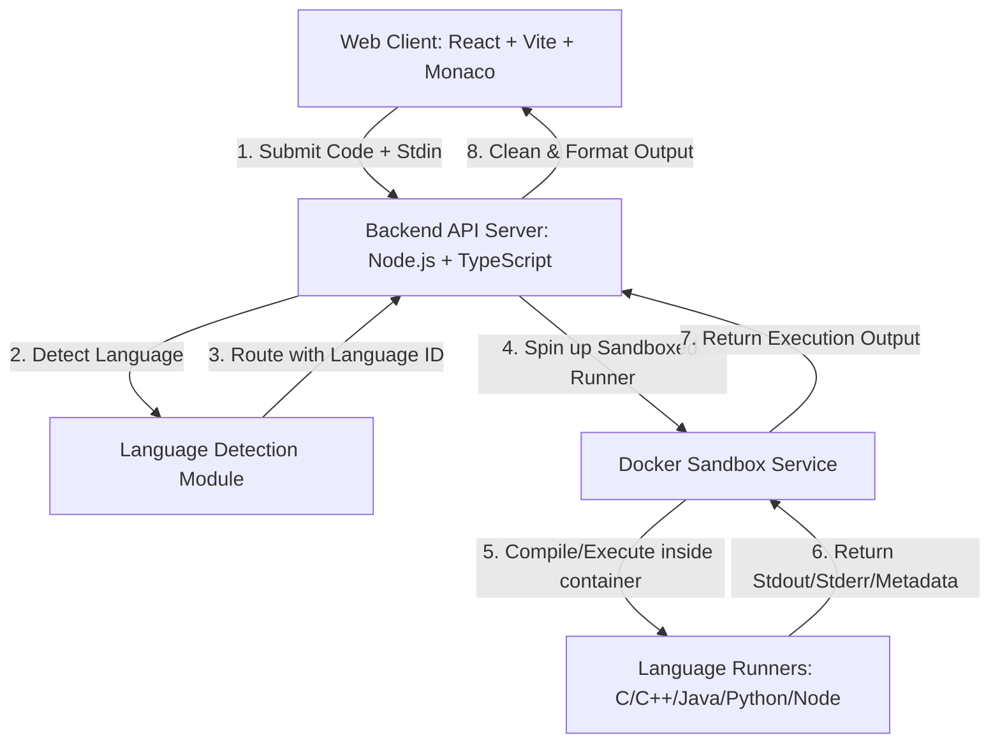

# Architecture Specification: Compiler for All

This document defines the high-level architecture, component interactions, and technical design principles for **Compiler for All**.

---

## 1. System Overview

Compiler for All is designed to lower the barrier of entry for beginner programmers. It provides a zero-config editor where the user writes code in one of the five supported languages (C, C++, Java, Python, JavaScript), and the platform detects the language, configures syntax highlighting, and runs the code securely.



---

## 2. Component breakdown

### 2.1 Web Frontend

- **Technology Stack**: React (v18+), Vite, TypeScript, Vanilla CSS for styling.
- **Key Responsibilities**:
  - Integrate the **Monaco Editor** for a rich IDE-like coding experience.
  - Perform _client-side speculative language detection_ to adjust syntax highlighting dynamically as the user types (debounce rate: 500ms).
  - Maintain console states: input buffer (stdin), standard output (stdout), compilation/runtime errors (stderr), and execution metrics (execution time, memory limit indicators).
  - Minimalist UI with glassmorphic aesthetics, custom dark mode, and micro-animations for status transitions.

### 2.2 Backend API Gateway

- **Technology Stack**: Node.js, Express (or Fastify), TypeScript.
- **Key Responsibilities**:
  - Expose endpoints for code execution (`POST /api/execute`) and health monitoring.
  - Perform _server-side authoritative language detection_ prior to compilation/interpretation.
  - Rate limit incoming requests to prevent Denial of Service (DoS) attacks.
  - Validate payload sizes (maximum code payload: 64KB; maximum stdin: 16KB).
  - Coordinate container orchestration for execution requests.

### 2.3 Language Detection Module

- **Technology Stack**: TypeScript helper library (shared between frontend and backend).
- **Algorithm**: Multi-Signal Heuristic Scoring.
  - **Signal A: Imports & Includes** (e.g., `#include <iostream>`, `import java.util.*`).
  - **Signal B: Key Syntax Patterns** (e.g., `public static void main`, `def `, `const `, `function`).
  - **Signal C: Syntactic Markers** (semi-colons, braces, pythonic indentation structures).
  - **Signal D: Keyword Frequency** (`cout`, `printf`, `System.out.println`, `console.log`).

### 2.4 Security Sandbox (Docker Service & Fallback)

- **Technology Stack**: Docker, gVisor runtime (`runsc`) for kernel-level security isolation, TypeScript sandbox manager (`server/src/compiler/sandbox.ts`).
- **Container Image Registry**:
  - **C / C++**: `gcc:12-bookworm` (Official GCC release on Debian 12 containing `gcc` C11 and `g++` C++17)
  - **Java**: `eclipse-temurin:17-jdk` (Official Eclipse Temurin OpenJDK 17 distribution containing `javac` and `java`)
  - **Python**: `python:3.10-slim` (Official Python 3.10 slim image)
  - **JavaScript**: `node:18-slim` (Official Node.js 18 slim image)
- **Isolating Constraints**:
  - **Network Block**: No internet access inside the running containers (`--network none`).
  - **CPU Core Cap**: 0.5 CPU core limit per execution (`--cpus="0.5"`).
  - **Memory & Swap Cap**: 64MB RAM limit per execution (`-m 64m --memory-swap 64m`).
  - **Process / Fork Limit**: Maximum 50 PID tasks (`--pids-limit 50`).
  - **File Descriptor Cap**: Maximum 64 open files (`--ulimit nofile=64:64`).
  - **Storage Access**: Read-only root filesystem (`--read-only`), read-only source workspace volume mount (`-v [tmpdir]:/workspace:ro`), and temporary writeable RAM-disk (`--tmpfs /tmp:rw,exec,nosuid,size=5m`). _Security Rationale for `exec` on `/tmp`_: Because the root filesystem `/` and source workspace volume `/workspace` are mounted read-only, `/tmp` is the sole writable location inside the container. Compilers (GCC/G++) and JVM class outputs must generate executable binaries in `/tmp`. Security isolation remains fully enforced via `--network none`, `--user 1000:1000`, `--read-only`, `--pids-limit 50`, `-m 64m`, and `--cpus 0.5`.
  - **Timeouts**: Hard total timeout of 10 seconds per execution; 5 seconds execution limit; 8 seconds compiler limit.
  - **User Privileges**: Run inside container as unprivileged user (`--user 1000:1000`).
  - **Auto-Cleanup**: Mandatory `--rm` flag and host `fs.rm` recursive cleanup on workspace disposal.
  - **Graceful Fallback**: `AutoSelectingSandboxRunner` detects Docker daemon availability via `isDockerAvailable()`. If Docker is running, execution routes to `DockerSandboxRunner`. If Docker is unconfigured or unavailable, execution falls back cleanly to `SandboxUnavailableRunner` without executing code on the host.

---

## 3. Data Flow

1.  **User Actions**: The user types code in the Monaco Editor on the frontend.
2.  **Specular Highlighting**: The frontend analyzes the text buffer. If a pattern matches a language (e.g., `print("hello")` -> Python), it updates Monaco's syntax model without reloading.
3.  **Execution Request**: The user clicks the "Run Code" button. The frontend sends a JSON payload to `POST /api/execute`:
    ```json
    {
      "code": "print('Hello, World!')",
      "stdin": ""
    }
    ```
4.  **Backend Authoritative Analysis**: The backend receives the code, runs the multi-signal detection module, and determines the language is `python`.
5.  **Sandbox Spawning**: The backend generates a temporary file structure, writes the code to a file inside a volume, and executes a Docker run command targeting the appropriate pre-built language image:
    - **C/C++**: GCC-based image compiles (`gcc main.c -o main`) and executes (`./main`).
    - **Java**: OpenJDK compiles (`javac Main.java`) and runs (`java Main`).
    - **Python**: Python slim runtime runs (`python3 main.py`).
    - **JavaScript**: Node.js slim runtime runs (`node main.js`).
6.  **Response Aggregation**: Standard output, standard error, exit codes, and compile status are captured, sanitized (stripping system directories and path leakages), and returned:
    ```json
    {
      "detectedLanguage": "python",
      "status": "success",
      "stdout": "Hello, World!\n",
      "stderr": "",
      "exitCode": 0,
      "timeMs": 42
    }
    ```

---

## 4. Error Hierarchy

- **System Errors (5xx)**: Sandbox allocation failure, container timeouts.
- **Compilation Errors**: Language-specific compiler warnings/errors returned in `stderr` with `status: "compilation_error"`.
- **Runtime Errors**: Execution-level failures (e.g., Segment faults, NullPointerExceptions, division by zero) returned in `stderr` with `status: "runtime_error"`.
- **Sandbox Violation Errors**: Triggered when the code exceeds memory, CPU, or write limits, returned in `stderr` with `status: "resource_limit_exceeded"`.
